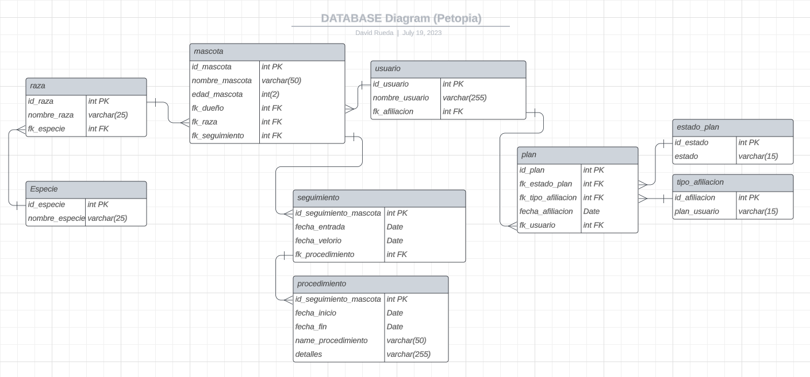
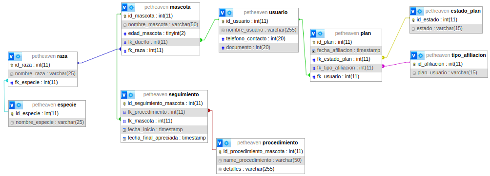

***PROYECTO Node.JS:***

# Petopia: A Slice of Pet Heaven

Petopia es un proyecto que busca darle solución a una funeraria que tiene el servicio de velar a una mascota mediante diferentes modalidades. El proyecto estará enfocado en crear únicamente el backend y generar los endpoints de que se consideren necesarios para el momento de conectarlo con el frond end. 

## Tabla de contenido 

- [Objetivos](#objetivos)
    - [objetivo general](#objetivo-general)
    - [objetivos especificos](#objetivos-específicos)
- [Diagrama MER](#diagrama-mer-de-la-base-de-datos)
- [base de datos](#construcción-de-la-base-de-datos)


# OBJETIVOS:
## Objetivo General

Petopia tiene como objetivo general sistematizar el manejo de datos de una funeraria enfocado en todo lo referente a afiliación y velación mascotas. 

## Objetivos específicos

* Crear una base de datos SQL que permita el correcto manejo de los datos del proyecto.
* Contruir un crud para todas las tablas de la base de datos pensando en una interfaz de administrador.
* Generar endPoints que permitan realizar consultas necesarias en el proyecto. Estas consultas estarán en la sección de *Consultas*


## Diagrama MER de la base de datos:




## Construcción de la base de datos: 
Se generaró una base de datos que contiene usuarios, información de la mascota, tipo de afiliación e información del proceso en el que se encuentra el tratamiento de la mascota en el momento que fallece y se aplica el plan. A continuación se encuentra el Diagrama de la base de datos final:

 

Se realizaron un par de modificaciones frente al diagrama MER en el transcurso de producción del proyecto con el objetivo de adecuar mejor la lógica de la base de datos.

## Instrucciones para la instalación del proyecto:

Para la correcta instalación del proyecto siga las siguientes instrucciones: 

1. Clone el repositorio del proyecto y abra el archivo del proyecto en su editor de código. (Recomdación: utilizar Visual studio code)
2. Una vez lo tenga en forma local, abra una terminal y acceda a la ruta ./backend, de la siguiente forma: 
```bash
    cd backend
``` 
3. Una vez la terminal se encuentre en la ruta backend, implemente las dependencias que están en el package.json usando el siguiente comando:
```bash
    npm update
``` 
De esta forma verá que la carpeta "*node_modules*" y el archivo "*package-lock.json*" se crean después de contados segundos. 
4. Para poder correr el proyecto de manera local es necesario configurar las variables de entorno. Por lo que puede dirigirse al archivo .env.example y observar la configuración del proyecto.
    * Dentro de la ruta backend cree un archivo que se llame ".env".
    * Luego de tener el archivo .env, copie y pegue la estructura que se observa en el .env.example.
    * Ingrese los datos requeridos. En el caso de manejar el proyecto local, el host sería localhost. 
    * El nombre de la base de datos que ejecutará más adelante es "petheaven", por lo que en el campo database puede ingresar este nombre.
    * En el campo de MY_CONFIG ingrese un hostname y un puerto a su elección. Recuerde que por defecto el local host requiere que el host name comience con 127. 
    * Verifique que el puerto que va a utilizar no esté en uso. Para evitar confisión mate todos los puertos que tiene abiertos en su máquina.
    * Por último la llave privada del JWT puede ser cualquier cadena de texto a su elección.
5. Una vez configuradas las dependencias del proyecto y definidas las variables de entorno sigue ejecutar la base de datos.
*   En este caso está pública para facilidad de la persona que evalúa.  
    * Dirijase a la ruta ./backend/src/db, ahí encontrará el archivo llamado db.sql
    * Para ejecutar este archivo instale la extensión de visual studio code "**MySQL**". Una vez instalada la extensión va a observar en la barra lateral izquiersa un cilindro. Al darle click se abrirá la barra lateral, seleccione el botón **+** ubicado en la parte superior (*add conecction*) y se desplegará una ventana donde se va a poder configurar la extensión para crear la conexión. Por defecto toda la configuración se dirige a una conección local, daremos en el botón de guardar y por último connect.
    * Si no desea utilizar esta extensión también puede ir ejecutando el script de la base de datos desde la consola. 
    * La ejecución de la base de datos está en orden.
6. Cuando ya tenga la base de datos localmente se dirigirá nuevamente a la terminal que había abierto anteriormente y levantará el servidor de manera local usando el siguiente comando: 
```bash
    npm run dev
``` 
Una vez levantado el servidor podrá utilizar una herramienta como Thunder-cliente o postman para realizar y verificar los endPoints generados y explicados anteriormente.
