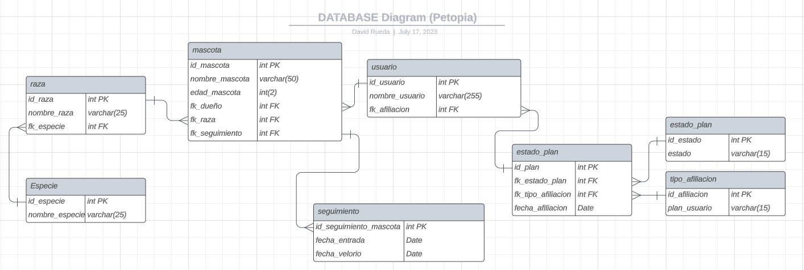
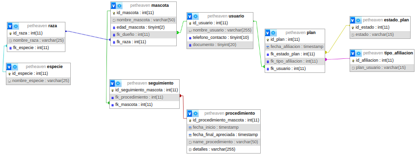

***PROYECTO Node.JS:***

# Petopia: A Slice of Pet Heaven

Petopia es un proyecto que busca darle solución a una funeraria que tiene el servicio de velar a una mascota mediante diferentes modalidades. El proyecto estará enfocado en crear únicamente el backend y generar los endpoints de que se consideren necesarios para el momento de conectarlo con el frond end. 

## Objetivo General

Petopia tiene como objetivo general sistematizar el manejo de datos de una funeraria enfocado en todo lo referente a afiliación y velación mascotas. 

## Objetivos específicos

* Crear una base de datos SQL que permita el correcto manejo de los datos del proyecto.
* Contruir un crud para todas las tablas de la base de datos pensando en una interfaz de administrador.
* Generar endPoints que permitan realizar consultas pertinentes teniendo en cuenta las relaciones. 

## Construcción de la base de datos: 
Se generará una base de datos que contiene usuarios, información de la mascota, tipo de afiliación e información de la entrega de la mascota 

Petopia buscará darle solución a una problemática real surgiente en una empresa de bucaramanga.

 